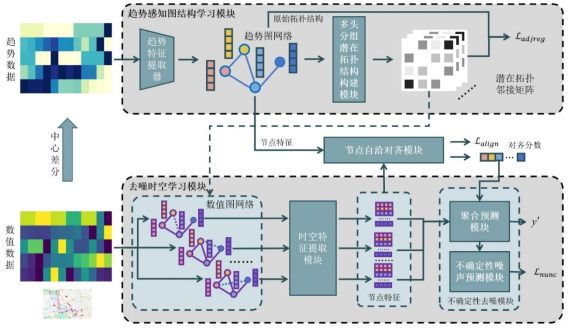

# TaGNN: Tendency-aware Graph Neural Network for Water Quality Prediction with Coupled Noise
## 主要贡献
   - By leveraging historical water quality trend features, the proposed model uncovers local interdependencies among raw water quality indicators to construct multiple potential hydrological topological structures, thereby effectively disentangling structural noise.
   - Utilizing the constructed adjacency matrices alongside original data, the model extracts spatio-temporal features to separate numerical noise.
   - Ultimately, coherent node representations across pre- and post-structure construction phases are aggregated based on the inferred latent structure to deliver water quality predictions.

